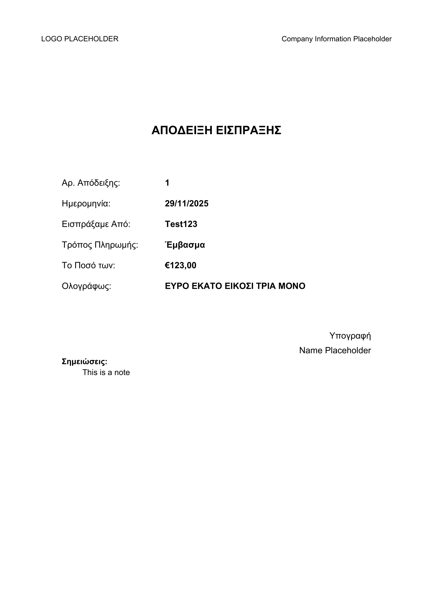
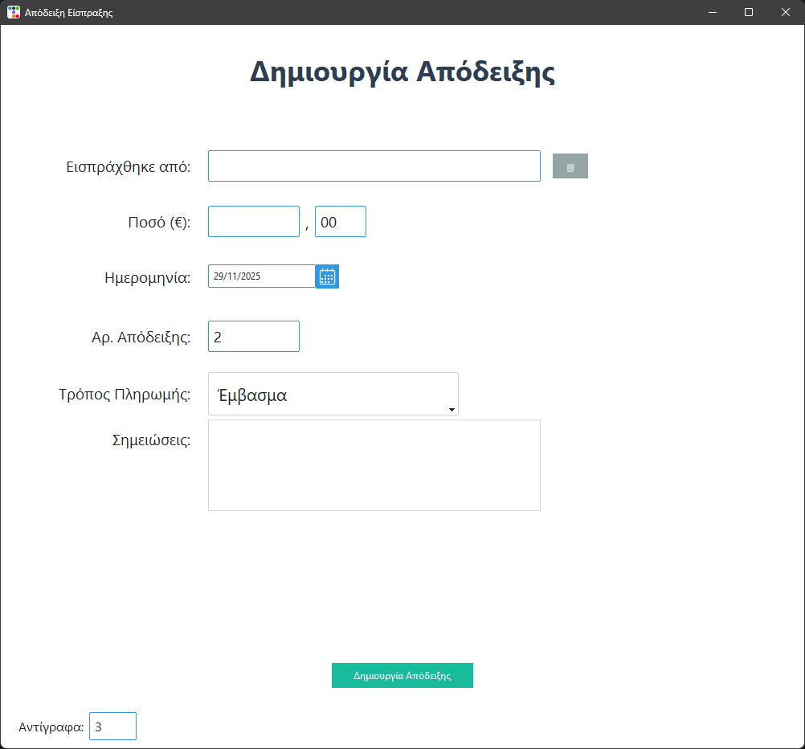
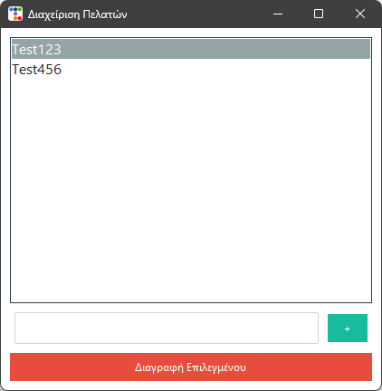

# 📄 Receipt Generator (Public Version)

A simple, fast, and user-friendly **receipt generation tool** built in Python using **Tkinter** and **ReportLab**.

This project was originally developed for my father’s company to make it easier for him to create consistent, professional receipts for clients.  
This public version contains **placeholder company information** and **sample data only**.

---

## 🚀 Features

### ✔️ **Automatic Receipt PDF Generation**  
The app creates clean, formatted **A4 PDF receipts**, fully styled and ready for printing.

### ✔️ **Number-to-Text Conversion (Greek)**  
Enter an amount like `123.00` → it automatically converts it to text:  
**«Ευρώ εκατό είκοσι τρία μόνο»**

### ✔️ **Automatic Physical Printing**  
Generated receipts can be automatically sent to a physical printer using **SumatraPDF** in silent/instant mode.

### ✔️ **Customer List Management**  
- Add customers  
- Remove customers  
- Automatically saved in a JSON file  
- Fully persistent between app launches

### ✔️ **Receipt History & Autosave**  
All generated receipts are automatically stored in the `/Receipts` folder with:  
- Receipt number  
- Customer name  
- Proper filename formatting

### ✔️ **Wrapped Notes Section**  
Add optional notes to each receipt — text automatically wraps inside the PDF.

### ✔️ **Modern UI**  
The app uses **ttkbootstrap** for a clean, modern interface.

---

## 🖼️ Sample Receipt

---

## 🛠️ Technologies Used

- **Python 3**
- **Tkinter** (GUI)
- **ttkbootstrap** (modern UI styling)
- **ReportLab** (PDF generation)
- **SumatraPDF** (silent printing)
- **JSON** (customer data storage)

---

## 🖥️ Application Screenshots

Below are screenshots of the application's user interface using placeholder data.  
These images show the main features and layout of the tool.

### 📌 Main Window
The central hub where you can:
- Enter receipt information  
- Select customers  
- Add notes  
- Generate & print receipts  

---

### 📌 Customers List
View, select, and remove saved customers.

---

## 📎 Notes

This repository **does not include any real company or personal information**.  
All sensitive details have been replaced with placeholders for public sharing.

---
